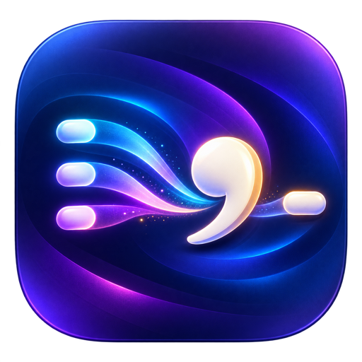

<p align="center">
  
</p>

<h1 align="center">Triple Space Comma</h1>

<p align="center"><strong>Press Space three times. Get a comma and a space. Anywhere on your Mac.</strong></p>

<p align="center">
  <a href="https://github.com/kingabuomar/triple-space-comma/actions/workflows/ci.yml"></a>
  <a href="https://github.com/kingabuomar/triple-space-comma/releases/latest"></a>
  
  
  <a href="LICENSE"></a>
</p>

<p align="center">
  <a href="https://github.com/kingabuomar/triple-space-comma/releases/latest">Download</a> ·
  <a href="#install">Install</a> ·
  <a href="PRIVACY.md">Privacy</a> ·
  <a href="#how-it-works">How it works</a> ·
  <a href="CONTRIBUTING.md">Contribute</a>
</p>

---

Triple Space Comma is a tiny native macOS utility that turns three quick presses of the spacebar into `, `. It works across apps, launches automatically when you sign in, and stays completely out of your way.

| You type | You get |
|---|---|
| `Hello␠␠␠` | `Hello,␠` |

It works whether macOS's built-in “Add period with double-space” option is enabled or disabled.

## Why it is different

- **Native and tiny.** Written in Swift with Apple system frameworks. No Electron, no runtime download.
- **Private by design.** It reads only key codes and timing long enough to recognize the gesture. It never stores text or keystrokes.
- **Offline.** No accounts, analytics, telemetry, update service, or network requests.
- **Automatic.** A per-user LaunchAgent starts it at login and keeps it available.
- **Universal.** Release builds support Apple Silicon and Intel Macs running macOS 13 or newer.

## Install

### Easiest: download the release

1. Download `Triple-Space-Comma-v1.0.0.zip` from [Releases](https://github.com/kingabuomar/triple-space-comma/releases/latest).
2. Unzip it.
3. Right-click **Install Triple Space Comma.command** and choose **Open**.
4. In **System Settings → Privacy & Security → Accessibility**, enable **Triple Space Comma**.

The release is ad-hoc signed and fully source-visible, but it is not Apple-notarized. macOS may therefore require the right-click **Open** step.

### Install from source

```bash
git clone https://github.com/kingabuomar/triple-space-comma.git
cd triple-space-comma
make install
```

Building from source requires Apple's Command Line Tools. Install them once with `xcode-select --install` if Swift is not already available.

## What gets installed

| Component | Location |
|---|---|
| App | `~/Applications/Triple Space Comma.app` |
| Startup agent | `~/Library/LaunchAgents/com.saifqawasmi.triplespacecomma.plist` |
| Lifecycle log | `~/Library/Logs/Triple Space Comma.log` |
| Upgrade backups | `~/Library/Application Support/Triple Space Comma/backups/` |

The app requests Accessibility permission because macOS requires it for system-wide keyboard shortcuts. See [PRIVACY.md](PRIVACY.md) for the exact data boundary.

## Uninstall

Double-click **Uninstall Triple Space Comma.command**, or run:

```bash
make uninstall
```

The uninstaller stops the login agent, resets the app's Accessibility entry, and moves installed files to a dated folder in the Trash so they remain recoverable.

## Build and verify

```bash
make test
make build
"dist/Triple Space Comma.app/Contents/MacOS/TripleSpaceComma" --self-test
```

`make test` runs the gesture-state unit tests and validates all shell scripts. `make build` creates an ad-hoc-signed universal app bundle and verifies its signature and embedded self-test.

## How it works

A macOS `CGEventTap` observes key-down events. The content-free state machine recognizes three non-repeating spacebar events whose gaps are no more than 0.7 seconds. The third space is suppressed; two preceding spacing characters are replaced with a comma and a trailing space. Synthetic replacement events carry a private marker so the app never reacts to its own output.

## Troubleshooting

If the gesture does nothing:

1. Confirm **Triple Space Comma** is enabled in **System Settings → Privacy & Security → Accessibility**.
2. Sign out and back in, or reinstall to reload the login agent.
3. Inspect the lifecycle log:

```bash
tail -n 30 "$HOME/Library/Logs/Triple Space Comma.log"
launchctl print "gui/$(id -u)/com.saifqawasmi.triplespacecomma"
```

## Project

Created by **Saif Qawasmi**. Contributions are welcome; start with [CONTRIBUTING.md](CONTRIBUTING.md). Security reports should follow [SECURITY.md](SECURITY.md).

Released under the [MIT License](LICENSE).
